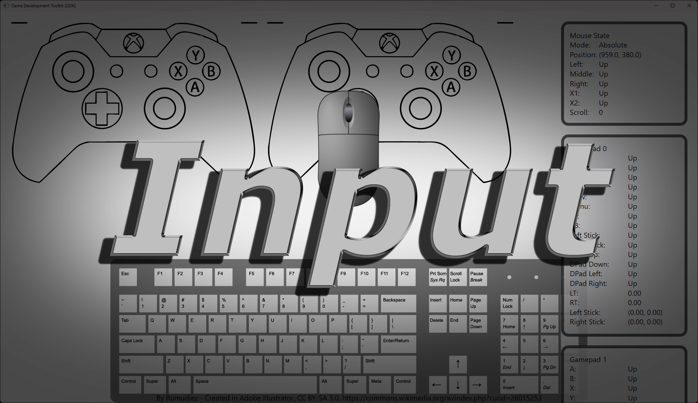
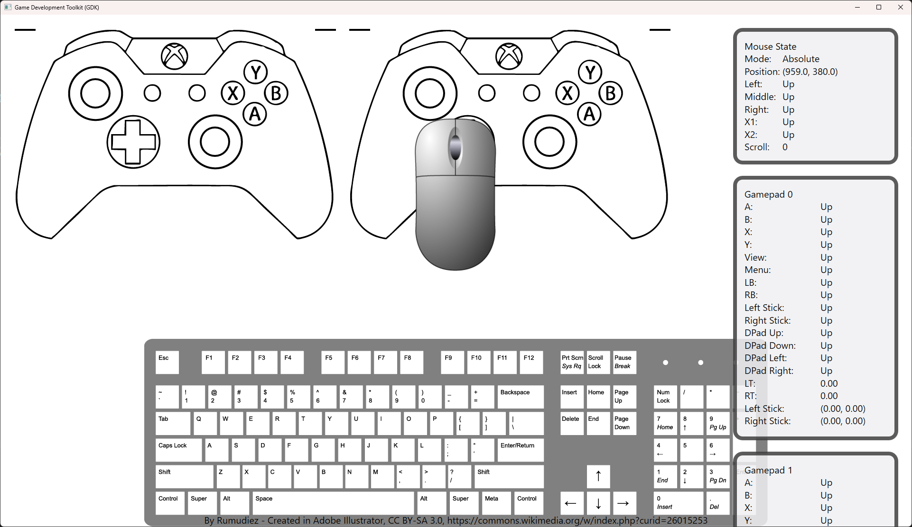

# Input


Input is a cross-platform C++ library for handling gamepad, keyboard, and mouse input.

It provides a unified API for querying input states and supports multiple backends, including SDL2, SDL3, GDK, GLFW, and Win32.

## Table of Contents

- [Input](#input)
  - [Table of Contents](#table-of-contents)
  - [Features](#features)
  - [Getting Started](#getting-started)
    - [Prerequisites](#prerequisites)
    - [Building](#building)
    - [Basic Usage](#basic-usage)
  - [Backends](#backends)
    - [Win32](#win32)
    - [Microsoft Game Development Kit](#microsoft-game-development-kit)
    - [GLFW](#glfw)
    - [SDL2 \& SDL3](#sdl2--sdl3)
  - [Samples](#samples)
  - [Gamepad](#gamepad)
  - [GamepadStateTracker](#gamepadstatetracker)
  - [Mouse](#mouse)
    - [Absolute Mode](#absolute-mode)
    - [Relative Mode](#relative-mode)
  - [MouseStateTracker](#mousestatetracker)
  - [Keyboard](#keyboard)
    - [Keyboard State](#keyboard-state)
  - [KeyboardStateTracker](#keyboardstatetracker)
  - [Input API](#input-api)
    - [Key Names](#key-names)
    - [Button Names](#button-names)
    - [Axis Names](#axis-names)
    - [Input Actions](#input-actions)
  - [Known Issues](#known-issues)
  - [License](#license)

## Features

- Unified input API for gamepad, keyboard, and mouse
- Multiple backend support (SDL2, SDL3, GDK, GLFW, Win32)
- Easy integration with CMake
- Sample applications included

## Getting Started

### Prerequisites

- CMake 3.12 or higher
- C++20 compatible compiler
- Supported backends (SDL2, SDL3, GDK, GLFW, Win32)

### Building

Clone the repository and configure the build options in CMake:

```sh
git clone https://github.com/3dgep/input.git
cd input
cmake -B build -DINPUT_USE_SDL3=ON -DINPUT_BUILD_SAMPLES=ON
cmake --build build
```

You can enable/disable backends using the following CMake options:

| CMake Option          | Description                                                                                        |
| --------------------- | -------------------------------------------------------------------------------------------------- |
| `INPUT_USE_SDL2`      | Build the input::SDL2 backend. SDL2 will be fetched if it is not already included in your project. |
| `INPUT_USE_SDL3`      | Build the input::SDL3 backend. SDL3 will be fetched if it is not already included in your project. |
| `INPUT_USE_GLFW`      | Build the GLFW backend. GLFW will be fetched if it is not already included in your project.        |
| `INPUT_USE_GDK`       | Build the input::GDK backend. Requires Windows Game Development Toolkit.                           |
| `INPUT_USE_WIN32`     | Build the Win32 backend. Only available if building for Windows.                                   |
| `INPUT_BUILD_SAMPLES` | Build samples. Only samples for enabled backends will be built.                                    |

For each enabled backed, there is a matching CMake target which you can add to your own targets using [target_link_libraries](https://cmake.org/cmake/help/latest/command/target_link_libraries.html).

For example, if you are creating an SDL3 application, make sure you enable the `INPUT_USE_SDL3` option in CMake, then add the `input::SDL3` target to your own application (or library):

```cmake
target_link_libraries( MySDL3App PUBLIC input::SDL3 )
```

Optionally, you can just copy the contents of the [inc](inc) folder into your project's include folder, the source files in the [src](src) folder, and **one** of the folders in the [backends](src/backends) folder, then compile it with your project.

### Basic Usage

Include the headers from [`inc`](inc) folder and link against the appropriate backend library. Example:

```cpp
#include <input/Input.hpp>

void updateInput();

void main()
{
    // Hook up any special callback functions, depending on the backend (see below).

    // You can create special action handlers for input:
    // Controls for the left paddle.
    input::Input::addAxisCallback( "Left Paddle", []( 
        std::span<const input::GamepadStateTracker> gamepadStates, 
        const input::KeyboardStateTracker& keyboardState, 
        const input::MouseStateTracker& mouseState ) 
    {
        float leftY  = gamepadStates[0].getLastState().thumbSticks.leftY;
        float rightY = gamepadStates[0].getLastState().thumbSticks.rightY;

        float w = keyboardState.isKeyDown( input::Keyboard::Key::W ) ? 1.0f : 0.0f;
        float s = keyboardState.isKeyDown( input::Keyboard::Key::S ) ? 1.0f : 0.0f;

        return std::clamp( s - w + leftY + rightY, -1.0f, 1.0f );
    } );

    // Controls for the right paddle.
    input::Input::addAxisCallback( "Right Paddle", []( 
        std::span<const input::GamepadStateTracker> gamepadStates, 
        const input::KeyboardStateTracker& keyboardState, 
        const input::MouseStateTracker& mouseState ) 
    {
        float leftY  = gamepadStates[1].getLastState().thumbSticks.leftY;
        float rightY = gamepadStates[1].getLastState().thumbSticks.rightY;

        float up   = keyboardState.isKeyDown( input::Keyboard::Key::Up ) ? 1.0f : 0.0f;
        float down = keyboardState.isKeyDown( input::Keyboard::Key::Down ) ? 1.0f : 0.0f;

        return std::clamp( down - up + leftY + rightY, -1.0f, 1.0f );
    } );

    bool isRunning = true;

    while(isRunning)
    {
        updateInput();
    }
}

void updateInput() {
   input::Input::update(); // Call this once per frame to update the mouse, keyboard, and gamepad states.

    float leftPaddle = input::Input::getAxis("Left Paddle"); // Invoke the "Left Paddle" action.
    float rightPaddle  = input::Input::getAxis("Right Paddle"); // Invoke the "Right Paddle" action.
    if( input::Input::getButton("Jump") ) // There are also some "default" actions you can just use in your game.
    {
        doJump();
    }
}
```

## Backends

Some backends require certain functions provided by the input library to be "hooked" into your applications message loop.

### Win32

The Win32 backend requires that you call the following functions in your application's message handler:

```cpp
// Forward declare callback functions.
void Keyboard_ProcessMessage( UINT message, WPARAM wParam, LPARAM lParam );
void Mouse_ProcessMessage( UINT message, WPARAM wParam, LPARAM lParam );

LRESULT CALLBACK WndProc( HWND hwnd, UINT msg, WPARAM wParam, LPARAM lParam )
{
    // Keyboard callback.
    Keyboard_ProcessMessage( msg, wParam, lParam );
    // Mouse callback.
    Mouse_ProcessMessage( msg, wParam, lParam );
    // The rest of your WndProc function...
}
```

The `Gamepad` does not require any special handling for Win32 applications.

See the [Win32 sample](samples/Win32/main.cpp) for details.

### Microsoft Game Development Kit

See [Game Development Kit (GDK)](https://learn.microsoft.com/en-us/gaming/gdk/) for more information.

The Microsoft Game Development Toolkit only requires special handling for the mouse:

```cpp
// Forward declare callback functions.
void Mouse_ProcessMessage( UINT message, WPARAM wParam, LPARAM lParam );

LRESULT CALLBACK WndProc( HWND hwnd, UINT msg, WPARAM wParam, LPARAM lParam )
{
    // Mouse callback.
    Mouse_ProcessMessage( msg, wParam, lParam );
    // Keyboard callback.
    // Keyboard_ProcessMessage( msg, wParam, lParam ); // You can call this when using GDK, but it's not required.

    // The rest of your WndProc function...
}
```

The `Gamepad` and `Keyboard` don't require any special handling.

See the [GDK sample](samples/GDK/main.cpp) for details.

### GLFW

See [www.glfw.org](https://www.glfw.org/) for more information on GLFW.

GLFW requires special functions to be registered with GLFW's callback function mechanism:

```cpp
// Forward-declare callback functions.
void Mouse_ScrollCallback( GLFWwindow*, double, double );
void Mouse_CursorPosCallback( GLFWwindow*, double, double );
void Mouse_ButtonCallback( GLFWwindow*, int, int, int );
void Keyboard_Callback( GLFWwindow* , int , int , int, int );

int main()
{
    // Initialize and create a GLFWwindow...

    // Register callback functions.
    glfwSetScrollCallback( g_pWindow, Mouse_ScrollCallback );
    glfwSetCursorPosCallback( g_pWindow, Mouse_CursorPosCallback );
    glfwSetMouseButtonCallback( g_pWindow, Mouse_ButtonCallback );
    glfwSetKeyCallback( g_pWindow, Keyboard_Callback );

}
```

The `Gamepad` doesn't require any special handling with GLFW.

### SDL2 & SDL3

See [www.libsdl.org](https://www.libsdl.org/) for more information on SDL2 & SDL3.

The input library will automatically hook into the SDL event loop using [`SDL_AddEventWatch`](https://wiki.libsdl.org/SDL2/SDL_AddEventWatch) (SDL2) or [`SDL_AddEventWatch`](https://wiki.libsdl.org/SDL3/SDL_AddEventWatch) (SDL3) so no special handling is required when using these backends.

The `GamepadSDL2` and `GamepadSDL3` classes will also enable the `SDL_INIT_GAMECONTROLLER` (SDL2) or the `SDL_INIT_GAMEPAD` (SDL3) subsystem in case you forget 😉.

See [SDL2](samples/SDL2/main.cpp) or [SDL3](samples/SDL3/main.cpp) samples for more detailed information.

## Samples

Sample applications are available in the [`samples`](samples) directory. Enable `INPUT_BUILD_SAMPLES` to build them.



## Gamepad

The [`Gamepad`](inc/input/Gamepad.hpp) class can be used as a singleton class, or if you find it more convenient to create an instance of a `Gamepad` object with an associated player ID.

The `Gamepad` class provides the following functions:

- `static Gamepad::State getState( int playerId, DeadZoneMode deadZoneMode )`: Get the current gamepad state for the player at index `playerId`.
- `static bool setVibration( int playerId, float leftMotor, float rightMotor, float leftTrigger, float rightTrigger )`: Set the controller vibration (rumble). Note: The GLFW backend does not support controller vibration.
- `static void suspend()`: Call this function when your game window loses focus.
- `static void resume()`: Call this function when your game window gains focus.

Although you should prefer to use input actions, you can read the gamepad state directly by using the `Gamepad::getState` function:

```cpp
void updateGamepads()
{
    for ( int i = 0; i < Gamepad::MAX_PLAYER_COUNT; ++i )
    {
        // Get the current state of the gamepad, apply independent axis deadzone mode.
        Gamepad::State state = Gamepad::getState( i, Gamepad::DeadZone::IndependentAxis ); 
        if ( state.connected )
        {
            if(state.buttons.a)
                // The a button is pressed on the controller.
            
            if(state.buttons.b)
                // The b button is pressed on the controller.
            
            // Similar for x, y, leftStick (click), rightStick (click), leftShoulder, rightShoulder, back/view, and start/menu buttons.

            if(state.dPad.up)
                // The D-pad is pressed up.

            // Similar for down, left, right D-pad buttons.

            if(state.thumbSticks.leftX > 0.5f) // Analog stick
                // The left analog stick is pushed to the right.
            
            // Similar for leftY, rightX, and rightY analog sticks.

            if(state.triggers.left > 0.5f) // Left trigger
                // The left triggers is pushed 50%

            // Similar for the right trigger.
            
        }
    }
}
```

The analog sticks will have deadzone applied according to the recommended deadzone for the controller (currently values below 0.24 are clamped to 0). There are two deadzone modes:

- `IndependentAxis`: Apply deadzone values to the X, and Y axis independently.
- `Circular`: Apply deadzone based on the radial distance from the center point.

Currently the deadzone for the thumbsticks is currently not configurable. The recommended value for XBox controllers (0.24) is used in all backends.

See the [Gamepad.hpp](inc/input/Gamepad.hpp) file for more information on the layout of the `Gamepad::State` structure.

## GamepadStateTracker

The `GamepadStateTracker` class is used to check if a button was "just pressed" or "just released" this frame. If you want to react to "pressed" and "released" states, you can do this in your controller logic:

```cpp
// Define a GamepadStateTracker for each gamepad you want to get pressed/released key states.
GamepadStateTracker gamepadStateTrackers[Gamepad::MAX_PLAYER_COUNT];

void updateGamepads()
{
    for ( int i = 0; i < Gamepad::MAX_PLAYER_COUNT; ++i )
    {
        // Get the current state of the gamepad, apply independent axis deadzone mode.
        Gamepad::State state = Gamepad::getState( i, Gamepad::DeadZone::IndependentAxis ); 

        // Update the gamepadStateTracker once per frame!
        gamepadStateTrackers[i].update( state );

        if ( state.connected )
        {
            if(gamepadStateTrackers[i].a == ButtonState::Pressed)
                // The a button was pressed this frame.
            
            if(gamepadStateTrackers[i].b == ButtonState::Released)
                // The b button was released this frame.
            
            // Similar for x, y, leftStick (click), rightStick (click), 
            // leftShoulder, rightShoulder, back/view, start/menu,
            // dPadUp, dPadDown, dPadLeft, dPadRight, 
            // leftTrigger, rightTrigger (with a threshold of 0.5 to emulate buttons)
            // and left/rightStickUp/Down/Left/Right (with a threshold of -0.5/0.5 to emulate buttons)
        }
    }
}
```

If a button is pressed or released in the current frame, the input system should report that regardless of how many times the input state is queried each frame. For this reason, it is important that each instance of the `GamepadStateTracker` is only updated once per frame. Multiple calls to `gamepadStateTracker.a` in the same frame should return the same up/held/pressed/released state.

You can also get the last state that the `GamepadStateTracker` was updated with using `GamepadStateTracker::getLastState`, but you can only determine if a button is up or down (held), but not if it was pressed/released this frame.

## Mouse

Since most systems only have a single mouse connected to the system, the mouse is a singleton class (actually, it's just a namespace). The `Mouse` (class) has the following functions:

- `Mouse::State getState()`: Get the current state of the mouse, including buttons, x, y position of the mouse, and the accumulated scroll wheel value.
- `void resetScrollWheelValue()`: Reset the accumulated scroll wheel value.
- `void setMode( Mode mode )`: Set the mouse mode to one of the following values:
  - `Absolute`: Mouse position is reported relative to the window.
  - `Relative`: Mouse position is reported in delta values (use the`resetRelativeMotion` function to reset the mouse deltas at the end of each frame).
- `void resetRelativeMotion()`: Reset the relative mouse deltas. You should call this function at the end of each frame regardless of the mouse mode.
- `bool isConnected()`: Returns `true` if a mouse is connected, `false` otherwise.
- `bool isVisible()`: Returns `true` if the mouse cursor is visible.
- `void setVisible( bool visible )`: Show or hide the mouse cursor.
- `void setWindow( void* window )`: Set the OS window handle (the type of this pointer is based on the current backend).

### Absolute Mode

Absolute mouse mode causes the mouse state to report the mouse position in window coordinates where the top-left corner of the window is (0,0). This is useful for menu navigation or pressing buttons in the game's UI.

When using Absolute mouse mode, the mouse cursor can leave the window which could be annoying for the end-user if they are controlling a player or camera using the mouse. When the mouse cursor leaves the window bounds, your game will stop receiving mouse events. To prevent the game from losing control when the mouse cursor leave the window bounds, use the `Relative` mode instead.

### Relative Mode

Relative mouse mode will cause the mouse state to report relative mouse deltas in the states's x, and y values. Some backends will poll for mouse movement in a separate thread so it's not always obvious when the mouse deltas should be reset. For this reason, you should call `Mouse::resetRelativeMotion()` at the end of each frame.

It's also not safe to reset the mouse deltas whenever `Mouse::getState()` is used. It is very important that `Mouse::getState` reports the *same* state when retrieving the state several times in the same frame. Resetting the mouse delta in the `Mouse::getState` function may cause unexpected behavior if the mouse state is queried several times per frame. That's why the mouse deltas (and scroll wheel values) are not reset automatically when reading the mouse state, and you should call `Mouse::resetRelativeMotion()` at the end of each frame to reset the delta values manually.

```cpp
void updateMouse()
{
    using Mouse::Mode::Absolute;
    using Mouse::Mode::Relative;

    Mouse::State mouseState = Mouse::getState();

    auto windowSize = window->GetSize();

    switch ( mouseState.positionMode )
    {
    case Absolute: // x, and y are in window space.
        g_MousePosition  = { mouseState.x, mouseState.y };
        g_fMouseRotation = 0.0f;
        break;
    case Relative: // x, and y are changes in movement since the last call to resetRelativeMotion.
        g_MousePosition = { windowSize.width / 2.0f, windowSize.height / 2.0f };
        g_fMouseRotation += mouseState.x + mouseState.y; // Rotate the mouse based on delta. movements.
        break;
    }
}
```

Please refer to any of the [samples](samples) for more information on handling mouse input.

## MouseStateTracker

The `Mouse::State` only reports the *current* state, but if you want to know how much the mouse has moved (when using `Absolute` mode) or whether a mouse button was pressed or released *this frame*, you will need to keep track of the previous mouse state. That's what the MouseStateTracker class does for you.

```cpp
MouseStateTracker mouseStateTracker; // Defined somewhere in your code.

void updateMouse()
{
    using ButtonState::Pressed;
    using ButtonState::Released;

    Mouse::State mouseState = Mouse::getState();

    // Update the mouse state tracker once per frame!
    mouseStateTracker.update( mouseState );

    // Check if the right mouse button was pressed this frame.
    if ( mouseStateTracker.rightButton == Pressed )
    {
        // Toggle the mouse mode.
        switch ( mouseState.positionMode )
        {
        case Absolute:
            Mouse::setMode( Relative );
            break;
        case Relative:
            Mouse::setMode( Absolute );
            break;
        }
    }
}
```

It is important that the `MouseStateTracker` reports pressed/released state consistently across the entire frame. Multiple calls to `MouseStateTracker::rightButton` should report the same state during the frame.

The `MouseStateTracker` class also has x, and y variables which will always report mouse deltas regardless of the mouse's input mode. It also keeps track of how much the scroll wheel has moved in the `scrollWheelDelta` member since the last call to `MouseStateTracker::update`.

## Keyboard

Similar to the mouse, there is usually only a single keyboard connected to your computer at a time. For this reason, the `Keyboard` is a singleton (actually, it's just a namespace) with the following functions:

- `Keyboard::State getState()`: Retrieve the current keyboard state.
- `void reset()`: Used by some of the backends to reset the internal keyboard state. This function should be called when game window loses focus to clear any "down" key states.
- `bool isConnected()`: Check to see if there is a keyboard connected.

### Keyboard State

It is important to note that this input system is not appropriate for creating text editors. It is intended to be used with games. In game development, you are usually only concerned with what key was pressed, released, or held down, but not concerned with the actual character that is produced when the key is pressed. For example, if the `A` key on the keyboard is pressed, then the `Keyboard::State::A` value will be `true`, but you won't be able to tell exactly which glyph should be displayed. (See [Keyboard layout](https://en.wikipedia.org/wiki/Keyboard_layout) for more information about various keyboard layouts).

> I've tested the keyboard mapping for all of the backends supported by this library, but I only have access to US QWERTY keyboards. If you notice a discrepancy with your keyboard, please post an issue in this repo.

The key value in the `Keyboard::Key` enumeration values are the 1:1 mapping to virtual key codes in Windows (See: [Virtual-key codes](https://learn.microsoft.com/en-us/windows/win32/inputdev/virtual-key-codes)) regardless of the backend you are using. All backend specific keys are mapped to the key value in the `Keyboard::Key` enumeration. (See [KeyboardGLFW.cpp](src/backends/GLFW/KeyboardGLFW.cpp) as an example).

## KeyboardStateTracker

Similar to the `GamepadStateTracker` and the `MouseStateTracker`, the `KeyboardStateTracker` can be used to check if a key is pressed this frame or released this frame.

```cpp
KeyboardStateTracker keyboardStateTracker; // Defined somewhere in your code.

void updateKeyboard()
{
    Keyboard::State state = Keyboard::getState();
    
    // Update the keyboard state tracker once per frame!
    keyboardStateTracker.update(state);

    if(keyboardStateTracker.pressed.A)
        // The A key was pressed this frame.

    if(keyboardStateTracker.released.A)
        // The A key was released this frame.

    if(keyboardStateTracker.lastState.A)
        // The A key is down this frame.
}
```

The KeyboardStateTracker class has the following (public) member variables:

- `Keyboard::State pressed`: The corresponding key is `true` if it was pressed *this frame*.
- `Keyboard::State released`: The corresponding key is `true` if it was released *this frame*.
- `Keyboard::State lastState`: The keyboard state that was last used to update the `KeyboardStateTracker`.

In addition to the public member variables, the keyboard state tracker also provides the following member functions:

- `bool isKeyPressed( Keyboard::Key key )`: Returns `true` if the key was pressed *this frame*.
- `bool isKeyReleased( Keyboard::Key key )`: Returns `true` if the key was released *this frame*.
- `Keyboard::State getLastState()`: Get the keyboard state that was last used to update the `KeyboardStateTracker`.

## Input API


The `Input` namespace provides access to keyboard keys, gamepad & mouse buttons, and gamepad axes. This implementation is inspired by Unity's Input system (see [Input](https://docs.unity3d.com/ScriptReference/Input.html) in the Unity script reference).

Internally, it stores a `KeyboardStateTracker`, `MouseStateTracker`, and a `GamepadStateTracker` for each connected gamepad.

Calling the `Input::update` method (once per frame) is required to let the `Input` class update its internal state.

The `Input` namespace provides the following methods:

- `void update()`: Call this once per frame to update the Input's internal state.
- `bool getKey( std::string_view keyName )`: Return `true` while the key is being held down on the keyboard. See [Key Names](#key-names) below.
- `bool getKeyDown( std::string_view keyName )`: Return `true` in the frame that the key is pressed. See [Key Names](#key-names) below.
- `bool getKeyUp( std::string_view keyName )`: Return `true` in the frame that the key is released. See [Key Names](#key-names) below.
- `bool getKey( Keyboard::Key key )`: Return `true` while the `Keyboard::Key` is being held down on the keyboard.
- `bool getKeyDown( Keyboard::Key key )`: Return `true` in the frame that the `Keyboard::Key` is pressed.
- `bool getKeyUp( Keyboard::Key key )`: Return `true` in the frame that the `Keyboard::Key` is released.
- `bool getButton( std::string_view buttonName )`: Get the state of a button. Returns `true` if the button is pressed down. See [Button Names](#button-names) below.
- `bool getButtonDown( std::string_view buttonName )`: Check to see if a button was pressed *this frame*. See [Button Names](#button-names) below.
- `bool getButtonUp( std::string_view buttonName )`: Check to see if a button was released *this frame*. See [Button Names](#button-names) below.
- `float getAxis( std::string_view axisName )`: Get the analog value of an axis. Depending on the axis, the value could be in the range of (0...1) or (-1...1). See [Axis Names](#axis-names) below.
- `bool getMouseButton( Mouse::Button button )`: Returns `true` when the `Mouse::Button` is held down.
- `bool getMouseButtonDown( Mouse::Button button )`: Returns `true` when the mouse button is pressed *this frame*.
- `bool getMouseButtonUp( Mouse::Button button )`: Returns `true` when the mouse button is released *this frame*.
- `float getMouseX()`: Return the X-coordinate of the mouse cursor.
  > **Note**: This will return relative movement of the mouse if the mouse mode is `Mouse::Mode::Relative`.
- `float getMouseY()`: Return the Y-coordinate of the mouse cursor.
  > **Note**: This will return relative movement of the mouse if the mouse mode is `Mouse::Mode::Relative`.
- `float getMouseMoveX()`: Return the horizontal movement of the mouse since the last call to `Input::update`.
  > **Note**: This will return the same value in both `Mouse::Mode::Absolute` and `Mouse::Mode::Relative`.
- `float getMouseMoveY()`: Return the vertical movement of the mouse since the last call to `Input::update`.
  > **Note**: This will return the same value in both `Mouse::Mode::Absolute` and `Mouse::Mode::Relative`.
- `void addAxisCallback( std::string_view axisName, AxisCallback callback )`: Add a callback function that is evaluated with the `getAxis( axisName )` function. See [Input Actions](#input-actions) below.
- `void addButtonCallback( std::string_view buttonName, ButtonCallback callback )`: Add a callback function that is evaluated with the `getButton( buttonName )` function. See [Input Actions](#input-actions) below.
- `void addButtonDownCallback( std::string_view buttonName, ButtonCallback callback )`: Add a callback function that is evaluated with the `getButtonDown( buttonName )` function. See [Input Actions](#input-actions) below.
- `void addButtonUpCallback( std::string_view buttonName, ButtonCallback callback )`: Add a callback function that is evaluated with the `getButtonUp( buttonName ) function. See [Input Actions](#input-actions) below.

The following type aliases are defined for `AxisCallback` and `ButtonCallback` callback functions:

```cpp
/// <summary>
/// An AxisCallback function takes a GamepadStateTracker (for each connected GamePad),
/// a KeyboardStateTracker, and a MouseStateTracker and returns the value of the axis
/// being queried (in the range [-1...1]).
/// </summary>
using AxisCallback = std::function<float( std::span<const GamepadStateTracker>, const KeyboardStateTracker&, const MouseStateTracker& )>;

/// <summary>
/// A ButtonCallback function takes a GamepadStateTracker (for each connected GamePad),
/// a KeyboardStateTracker, and a MouseStateTracker and returns the state of the button.
/// </summary>
using ButtonCallback = std::function<bool( std::span<const GamepadStateTracker>, const KeyboardStateTracker&, const MouseStateTracker& )>;
```

The primary difference between `AxisCallback` and `ButtonCallback` is that `AxisCallback` returns a `float` indicating the axis value, and `ButtonCallback` returns a `bool` which should be `true` if the button is pressed/held/released (depending on how the callback function is used). See [Input Actions](#input-actions) below.

### Key Names

The following key names are available:

| Key Name      | `Keyboard::Key` Value   |
| ------------- | ----------------------- |
| "a"           | `Key::A`                |
| "b"           | `Key::B`                |
| "c"           | `Key::C`                |
| "d"           | `Key::D`                |
| "e"           | `Key::E`                |
| "f"           | `Key::F`                |
| "g"           | `Key::G`                |
| "h"           | `Key::H`                |
| "i"           | `Key::I`                |
| "j"           | `Key::J`                |
| "k"           | `Key::K`                |
| "l"           | `Key::L`                |
| "m"           | `Key::M`                |
| "n"           | `Key::N`                |
| "o"           | `Key::O`                |
| "p"           | `Key::P`                |
| "q"           | `Key::Q`                |
| "r"           | `Key::R`                |
| "s"           | `Key::S`                |
| "t"           | `Key::T`                |
| "u"           | `Key::U`                |
| "v"           | `Key::V`                |
| "w"           | `Key::W`                |
| "x"           | `Key::X`                |
| "y"           | `Key::Y`                |
| "z"           | `Key::Z`                |
| "1"           | `Key::D1`               |
| "2"           | `Key::D2`               |
| "3"           | `Key::D3`               |
| "4"           | `Key::D4`               |
| "5"           | `Key::D5`               |
| "6"           | `Key::D6`               |
| "7"           | `Key::D7`               |
| "8"           | `Key::D8`               |
| "9"           | `Key::D9`               |
| "0"           | `Key::D0`               |
| "up"          | `Key::Up`               |
| "down"        | `Key::Down`             |
| "left"        | `Key::Left`             |
| "right"       | `Key::Right`            |
| "[1]"         | `Key::NumPad1`          |
| "[2]"         | `Key::NumPad2`          |
| "[3]"         | `Key::NumPad3`          |
| "[4]"         | `Key::NumPad4`          |
| "[5]"         | `Key::NumPad5`          |
| "[6]"         | `Key::NumPad6`          |
| "[7]"         | `Key::NumPad7`          |
| "[8]"         | `Key::NumPad8`          |
| "[9]"         | `Key::NumPad9`          |
| "[0]"         | `Key::NumPad0`          |
| "[+]"         | `Key::Add`              |
| "[-]"         | `Key::Subtract`         |
| "[*]"         | `Key::Multiply`         |
| "[=]"         | `Key::Separator`        |
| "[/]"         | `Key::Divide`           |
| "caps"        | `Key::CapsLock`         |
| "capslock"    | `Key::CapsLock`         |
| "shift"       | `Key::ShiftKey`         |
| "left shift"  | `Key::LeftShift`        |
| "right shift" | `Key::RightShift`       |
| "ctrl"        | `Key::ControlKey`       |
| "left ctrl"   | `Key::LeftControl`      |
| "right ctrl"  | `Key::RightControl`     |
| "alt"         | `Key::AltKey`           |
| "left alt"    | `Key::LeftAlt`          |
| "right alt"   | `Key::RightAlt`         |
| "left super"  | `Key::LeftSuper`        |
| "right super" | `Key::RightSuper`       |
| "left win"    | `Key::LeftSuper`        |
| "right win"   | `Key::RightSuper`       |
| "backspace"   | `Key::Back`             |
| "tab"         | `Key::Tab`              |
| "enter"       | `Key::Enter`            |
| "return"      | `Key::Enter`            |
| "esc"         | `Key::Escape`           |
| "escape"      | `Key::Escape`           |
| "space"       | `Key::Space`            |
| "delete"      | `Key::Delete`           |
| "ins"         | `Key::Insert`           |
| "insert"      | `Key::Insert`           |
| "home"        | `Key::Home`             |
| "end"         | `Key::End`              |
| "pgup"        | `Key::PageUp`           |
| "page up"     | `Key::PageUp`           |
| "pgdn"        | `Key::PageDown`         |
| "page down"   | `Key::PageDown`         |
| ";"           | `Key::OemSemicolon`     |
| "+"           | `Key::OemPlus`          |
| ","           | `Key::OemComma`         |
| "-"           | `Key::OemMinus`         |
| "."           | `Key::OemPeriod`        |
| "?"           | `Key::OemQuestion`      |
| "~"           | `Key::OemTilde`         |
| "`"           | `Key::OemTilde`         |
| "["           | `Key::OemOpenBrackets`  |
| "{"           | `Key::OemOpenBrackets`  |
| "]"           | `Key::OemCloseBrackets` |
| "}"           | `Key::OemCloseBrackets` |
| "'"           | `Key::OemQuotes`        |
| "\""          | `Key::OemQuotes`        |
| "\|"          | `Key::OemPipe`          |
| "\\"          | `Key::OemPipe`          |
| "F1"          | `Key::F1`               |
| "f1"          | `Key::F1`               |
| "F2"          | `Key::F2`               |
| "f2"          | `Key::F2`               |
| "F3"          | `Key::F3`               |
| "f3"          | `Key::F3`               |
| "F4"          | `Key::F4`               |
| "f4"          | `Key::F4`               |
| "F5"          | `Key::F5`               |
| "f5"          | `Key::F5`               |
| "F6"          | `Key::F6`               |
| "f6"          | `Key::F6`               |
| "F7"          | `Key::F7`               |
| "f7"          | `Key::F7`               |
| "F8"          | `Key::F8`               |
| "f8"          | `Key::F8`               |
| "F9"          | `Key::F9`               |
| "f9"          | `Key::F9`               |
| "F10"         | `Key::F10`              |
| "f10"         | `Key::F10`              |
| "F11"         | `Key::F11`              |
| "f11"         | `Key::F11`              |
| "F12"         | `Key::F12`              |
| "f12"         | `Key::F12`              |

### Button Names

The following button names are available (by default):

| Button Name           | Description                                                        |
| --------------------- | ------------------------------------------------------------------ |
| "win"                 | Left or Right Windows/Super key                                    |
| "mouse 0"             | Left mouse button                                                  |
| "mouse 1"             | Right mouse button                                                 |
| "mouse 2"             | Middle mouse button                                                |
| "mouse x1"            | Mouse XButton1                                                     |
| "mouse x2"            | Mouse XButton2                                                     |
| "joystick button 1"   | Gamepad A button (any connected gamepad)                           |
| "joystick button 2"   | Gamepad B button (any connected gamepad)                           |
| "joystick button 3"   | Gamepad X button (any connected gamepad)                           |
| "joystick button 4"   | Gamepad Y button (any connected gamepad)                           |
| "joystick button 5"   | Gamepad Left Shoulder (any connected gamepad)                      |
| "joystick button 6"   | Gamepad Right Shoulder (any connected gamepad)                     |
| "joystick button 7"   | Gamepad View/Back button (any connected gamepad)                   |
| "joystick button 8"   | Gamepad Menu/Start button (any connected gamepad)                  |
| "joystick button 9"   | Gamepad Left Stick (any connected gamepad)                         |
| "joystick button 10"  | Gamepad Right Stick (any connected gamepad)                        |
| "joystick dpad up"    | Gamepad D-pad Up (any connected gamepad)                           |
| "joystick dpad down"  | Gamepad D-pad Down (any connected gamepad)                         |
| "joystick dpad left"  | Gamepad D-pad Left (any connected gamepad)                         |
| "joystick dpad right" | Gamepad D-pad Right (any connected gamepad)                        |
| "joystick N button M" | Gamepad M button for gamepad N (N=1-4, M=1-10)                     |
| "joystick N dpad dir" | Gamepad D-pad direction (up/down/left/right) for gamepad N (N=1-4) |
| "Submit"              | Gamepad A, Enter, or Space                                         |
| "Cancel"              | Gamepad B or Escape                                                |

These button names can be used with `getButton` to check if the button is held down, `getButtonDown` to check if the button was pressed this frame, and `getButtonUp` to check if the button was released this frame.

You can add your own button names at runtime using the `addButtonCallback`, `addButtonDownCallback`, and `addButtonCallback` functions. See [Input Actions](#input-actions) below.

### Axis Names

The following predefined axis names are available by default.

| Axis Name           | Description                                                                |
| ------------------- | -------------------------------------------------------------------------- |
| "Horizontal"        | Left/right movement from gamepad thumbsticks and keyboard (A/D/Left/Right) |
| "Vertical"          | Up/down movement from gamepad thumbsticks and keyboard (W/S/Up/Down)       |
| "Fire1"             | Gamepad right trigger, left control key, or left mouse button              |
| "Fire2"             | Gamepad left trigger, left alt key, or right mouse button                  |
| "Fire3"             | Left shift key or middle mouse button is held down                         |
| "Jump"              | Gamepad A button or space key is held down                                 |
| "Mouse X"           | Mouse X movement (relative motion when using Mouse::Mode::Relative)        |
| "Mouse Y"           | Mouse Y movement (relative motion when using Mouse::Mode::Relative)        |
| "Mouse ScrollWheel" | Mouse scroll wheel value                                                   |
| "Submit"            | Gamepad A button, Enter key, or Space key                                  |
| "Cancel"            | Gamepad B button or Escape key                                             |

> **Note:** Some axis names ("Jump", "Submit", and "Cancel") are mapped to gamepad buttons and keyboard keys. **These actions will return 1.0 while the button on the gamepad or key on the keyboard is held down.**

You can add your own axis names at runtime using the `addAxisCallback` function. See [Input Actions](#input-actions) below.

### Input Actions

Input actions allow you to map game events (such as movement, jumping, or menu navigation) to custom callback functions. This enables flexible control schemes, remapping, and dynamic input configuration for your game or application.

You can define your own callback functions at runtime. **If you add an input action with a name that already exists, the previous callback will be replaced.** This makes it easy to update or remap actions as needed.

**Common use cases:**

- Remapping controls for accessibility or user preferences
- Supporting multiple input devices
- Dynamic configuration (e.g., changing actions based on game state)

**API Reference:** See the [Input API](#input-api) section for details on callback signatures and usage.

Below is an example that creates several actions for a 2D platforming game:

| Action Name  | Description                                                                                                   |
| ------------ | ------------------------------------------------------------------------------------------------------------- |
| "Horizontal" | Left/right movement of the left thumbstick on any gamepad or A/D/Left/Right keys are pressed on the keyboard. |
| "Jump"       | The A button on any gamepad is pressed or Space/W/Up on the keyboard is pressed (this frame).                 |
| "Next"       | Load the next level if the start button on any gamepad is pressed this frame.                                 |
| "Previous"   | Go to the previous level if the back button on any gamepad is pressed this frame.                             |
| "Reload"     | Reload the current level if the B button is pressed on any gamepad.                                           |

> **Note:** Input actions should provide both gamepad and keyboard input. In the case of the "Next", "Previous" and "Reload" actions, there is no keyboard input, but there are on-screen buttons that the end user can click with the mouse.

```cpp
// Horizontal movement: combines gamepad thumbstick and keyboard keys (A/D/Left/Right)
Input::addAxisCallback( "Horizontal", []( std::span<const GamepadStateTracker> gamepadStates, const KeyboardStateTracker& keyboardState, const MouseStateTracker& mouseState ) {
    float leftX = 0.0f;
    for ( auto& gamepadState: gamepadStates ) {
        const auto state = gamepadState.getLastState();
        leftX += state.thumbSticks.leftX;
    }
    const auto keyState = keyboardState.getLastState();
    const float a     = keyState.A ? 1.0f : 0.0f;
    const float d     = keyState.D ? 1.0f : 0.0f;
    const float left  = keyState.Left ? 1.0f : 0.0f;
    const float right = keyState.Right ? 1.0f : 0.0f;
    return std::clamp( leftX - a + d - left + right, -1.0f, 1.0f );
} );

// Jump action: triggers when gamepad A or Space/W/Up on keyboard is pressed
Input::addButtonDownCallback( "Jump", []( std::span<const GamepadStateTracker> gamepadStates, const KeyboardStateTracker& keyboardState, const MouseStateTracker& mouseState ) {
    bool a = false;
    for ( auto& gamepadState: gamepadStates ) {
        a = a || gamepadState.a == ButtonState::Pressed;
    }
    const bool space = keyboardState.isKeyPressed( KeyCode::Space );
    const bool up    = keyboardState.isKeyPressed( KeyCode::Up );
    const bool w     = keyboardState.isKeyPressed( KeyCode::W );
    return a || space || up || w;
} );

// Next level: triggers when gamepad Start button is pressed
Input::addButtonDownCallback( "Next", []( std::span<const GamepadStateTracker> gamepadStates, const KeyboardStateTracker& keyboardState, const MouseStateTracker& mouseState ) {
    bool start = false;
    for ( auto& gamepadState: gamepadStates ) {
        start = start || gamepadState.start == ButtonState::Pressed;
    }
    return start;
} );

// Previous level: triggers when gamepad Back button is pressed
Input::addButtonDownCallback( "Previous", []( std::span<const GamepadStateTracker> gamepadStates, const KeyboardStateTracker& keyboardState, const MouseStateTracker& mouseState ) {
    bool back = false;
    for ( auto& gamepadState: gamepadStates ) {
        back = back || gamepadState.back == ButtonState::Pressed;
    }
    return back;
} );

// Reload level: triggers when gamepad B or Enter on keyboard is pressed
Input::addButtonDownCallback( "Reload", []( std::span<const GamepadStateTracker> gamepadStates, const KeyboardStateTracker& keyboardState, const MouseStateTracker& mouseState ) {
    bool b = false;
    for ( auto& gamepadState: gamepadStates ) {
        b = b || gamepadState.b == ButtonState::Pressed;
    }
    const bool enter = keyboardState.isKeyPressed( KeyCode::Enter );
    return b || enter;
} );
```

With these actions defined, you can check if any of the actions are triggered by calling the appropriate functions in the input system:

```cpp
// Example usage in your game loop:
if ( Input::getAxis( "Horizontal" ) != 0.0f ) {
    setState( State::Run );
}
if ( Input::getButtonDown( "Jump" ) ) {
    setState( State::Jump );
}
if ( Input::getButtonDown( "Next" ) ) {
    onNextClicked();
}
if ( Input::getButtonDown( "Previous" ) ) {
    onPreviousClicked();
}
if ( Input::getButtonDown( "Reload" ) ) {
    onRestartClicked();
}
```

> **TODO:** It would be nice if there was a way to create custom input mappings or custom actions in scripts. This is not currently supported by the input system, but you can use axis and button callback functions to change the way an action is evaluated (including reading your game's own custom configuration settings to evaluate actions).

## Known Issues

- The Win32 and GDK backends only support XBox controllers (as far as I can tell).
- The GLFW backend does not treat the Nintendo Switch Pro controller correctly (more research is required). If you want to support Nintendo Switch Pro controllers, you should use the SDL2 or SDL3 backends.
- SDL2 swaps the A/B and X/Y values on Nintendo controllers. It reports the face values, not the face position (north, east, south, west). SDL3 maps these buttons correctly based on their face position, not the face value.
- SDL2, SDL3, and GLFW invert the Y-axis on the thumbsticks (compared to the Win32 and GDK backends). Personally, I think pushing up on the thumbstick should result in +1.0, but SDL2, SDL3, and GLFW report the raw USB values reported from the controller. I intentionally left this behaviour to avoid unexpected behaviour for those backends.
- I only tested this input library with controllers I have at my disposal (XBox One, XBox Elite, PS4, PS5, and Nintendo Switch Pro). If you have another gamepad that you can test it with, let me know (jeremiah at 3dgep.com)!
- Currently no (built-in) way to create custom configurations.
- Currently no Steam Input support (but if you're using Steam Input, maybe you won't use this library?).

If you encounter any other issues, please report them in the issues for this repo.

## License

This project is licensed under the MIT License. See: [LICENSE](LICENSE).
